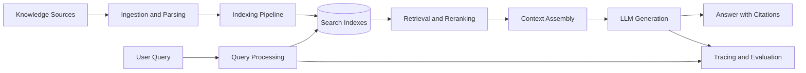

# Enterprise RAG Platform

> Status: `Planning / In Progress / Production` · Role: `TBD` · Timeline: `YYYY.MM — YYYY.MM`

## Overview

<!-- 用 2～3 句话说明知识场景、RAG 的作用，以及可验证的交付结果。 -->

| Item | Details |
| --- | --- |
| Problem | `TBD` |
| Target users | `TBD` |
| Knowledge scope | `TBD` |
| Responsibilities | `TBD` |
| Technology stack | `TBD` |
| Outcome | `TBD（使用可验证结果，避免笼统描述）` |

## Business Background

### Context

<!-- 描述知识如何产生、维护和消费，以及项目启动前的使用流程。 -->

### Pain Points

- `待填写：知识获取或检索方面的问题`
- `待填写：答案可信度、时效性或权限方面的限制`
- `待填写：为什么现有方案无法满足需求`

### Goals and Non-goals

| Goals | Non-goals |
| --- | --- |
| `TBD` | `TBD` |

## System Architecture

<!-- 将占位节点替换为真实组件，并区分离线索引链路与在线问答链路。 -->

### Component Responsibilities

| Component | Responsibility | Interface / Protocol |
| --- | --- | --- |
| `TBD` | `TBD` | `TBD` |

## Core Workflow

1. **Content ingestion** — `描述数据接入、解析、清洗和元数据处理。`
2. **Index construction** — `描述切分、Embedding、索引和更新策略。`
3. **Query processing** — `描述查询理解、改写、过滤和权限处理。`
4. **Retrieval and generation** — `描述召回、重排、上下文构建和生成约束。`
5. **Citation and feedback** — `描述引用验证、拒答、反馈和失败样本沉淀。`

### Failure Paths

<!-- 补充无结果、低相关性、权限冲突、知识过期和服务降级处理。 -->

## Technical Design

### Data and Indexing

<!-- 描述数据契约、Chunk 策略、索引类型、增量更新与版本管理。 -->

### Retrieval and Generation

<!-- 描述混合检索、过滤、重排、上下文预算、引用和拒答机制。 -->

### Reliability and Observability

<!-- 描述链路追踪、质量监控、成本分析、权限审计和反馈闭环。 -->

### Key Decisions

| Decision | Alternatives | Rationale | Trade-off |
| --- | --- | --- | --- |
| `TBD` | `TBD` | `TBD` | `TBD` |

## Engineering Challenges

| Challenge | Why It Matters | Approach | Remaining Risk |
| --- | --- | --- | --- |
| `TBD` | `TBD` | `TBD` | `TBD` |

<!-- 建议覆盖异构文档、检索质量、权限隔离、知识更新和成本控制等真实挑战。 -->

## Evaluation

### Evaluation Setup

<!-- 说明评测集构建、标注方式、检索与生成基线、通过标准和回归机制。 -->

| Metric | Definition | Baseline | Result | Target |
| --- | --- | ---: | ---: | ---: |
| Recall@K | `TBD` | — | — | — |
| Answer correctness | `TBD` | — | — | — |
| Citation accuracy | `TBD` | — | — | — |
| P95 latency | `TBD` | — | — | — |
| Cost per query | `TBD` | — | — | — |

### Result Analysis

<!-- 分析检索与生成阶段的误差来源、失败样本和结论适用边界。 -->

## Lessons Learned

- **What worked:** `TBD`
- **What did not work:** `TBD`
- **Key trade-off:** `TBD`
- **Reusable insight:** `TBD`
- **Next iteration:** `TBD`
