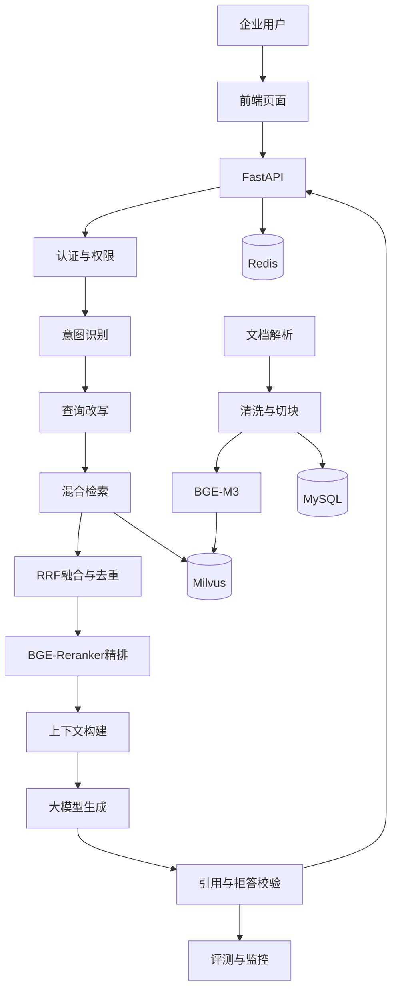

# 企业制度检索与办事流程智能导引平台

## 1. 项目定位

该项目面向企业内部制度检索、办事流程查询和知识治理场景，构建可私有化部署的企业级 RAG 平台。

系统将企业制度、流程规范、技术资料和常见问题统一入库，通过查询理解、混合检索、重排序和引用校验，为员工提供基于企业私有知识的问答与流程导引能力。

项目重点解决：

- 制度文档分散；
- 搜索依赖精确关键词；
- 文档版本更新频繁；
- 扫描件和复杂文档解析质量不稳定；
- 回答缺少来源；
- 知识库权限难以隔离；
- 线上问题难以定位。

---

## 2. 业务背景

企业内部通常存在大量：

- 规章制度；
- 人事与财务流程；
- 技术规范；
- 产品手册；
- 部门通知；
- 常见问题；
- 扫描件和历史文档。

传统检索方式存在以下问题：

- 用户必须知道准确文件名或关键词；
- 同义表达难以召回；
- 多个版本容易冲突；
- 文档过期后仍可能被检索；
- 搜索结果需要人工再次阅读；
- 无法直接给出办理步骤和依据。

因此，系统将知识治理、检索和大模型生成结合，形成完整的企业知识服务链路。

---

## 3. 总体架构



---

## 4. 知识入库流程

完整入库链路：

```text
文档上传
  ↓
格式识别
  ↓
内容解析
  ↓
清洗与结构恢复
  ↓
切块
  ↓
元数据补全
  ↓
向量化
  ↓
写入索引
  ↓
生成入库报告
  ↓
质量门禁
  ↓
激活新版本
```

只有通过质量门禁的知识版本才能进入线上检索。

---

## 5. 文档解析

支持处理：

- PDF；
- Word；
- Excel；
- Markdown；
- 图片；
- 扫描件。

解析阶段重点解决：

- 页眉页脚干扰；
- 水印；
- 多栏排版；
- 表格结构丢失；
- OCR 错误；
- 标题层级丢失；
- 图片与正文分离；
- 编码异常。

对于复杂 PDF 和扫描件，先转换为结构化 Markdown，再进行后续清洗。

---

## 6. 数据清洗与质量治理

入库前需要检查：

- 文档是否重复；
- 是否为最新版本；
- OCR 置信度是否合格；
- 元数据是否完整；
- 是否存在内容冲突；
- 是否包含无效页面；
- 是否缺少正文；
- 是否存在过期标记。

问题文档不会直接写入正式知识库，而是进入待处理队列。

处理流程：

```text
生成入库报告
  ↓
质量门禁检查
  ↓
合格文档暂存
  ↓
问题文档单独修复
  ↓
重新解析与质检
  ↓
合并入库
  ↓
重新生成报告
  ↓
通过后激活
```

---

## 7. 切块策略

不同文档需要不同切块方式。

### 固定长度切块

适合结构简单的短文档。

### 标题层级切块

适合制度、手册和流程文档，可以保留章节关系。

### 语义切块

根据内容语义边界切分，减少一个知识点被截断。

### 父子切块

```text
父块：保留完整章节
子块：用于精确召回
召回子块后：回填父块
```

父子切块能够兼顾召回精度和生成上下文完整性。

切块时保留：

- 文档标题；
- 章节标题；
- 页码；
- 来源；
- 部门；
- 生效时间；
- 版本号；
- 权限范围。

---

## 8. 知识库版本管理

系统为每个文档和索引记录版本信息：

- 文件指纹；
- 文档版本；
- 切块版本；
- Embedding 模型版本；
- 索引版本；
- 激活状态；
- 更新时间。

知识状态：

```text
待处理
  ↓
已解析
  ↓
待质检
  ↓
已通过
  ↓
已激活
  ↓
已废弃
```

新版本激活后，旧版本退出线上检索，但仍保留用于回滚和审计。

---

## 9. 查询路由

系统在检索前识别用户意图。

常见路由：

- 简单问候；
- 常见问题；
- 数据查询；
- 制度检索；
- 办事流程；
- 信息不足需澄清；
- 超出范围需拒答。

简单场景由规则或 FAQ 直接返回，减少模型调用。

复杂问题进入 RAG 检索链路。

---

## 10. 查询理解与改写

用户表达可能存在：

- 口语化；
- 指代不清；
- 关键词不足；
- 多轮上下文依赖；
- 多个问题混合。

系统使用：

- 指代消解；
- 查询改写；
- Multi-Query；
- HyDE；
- 关键词补全。

例如：

```text
原问题：
这个补贴怎么申请？

改写后：
员工交通补贴的申请条件、所需材料和办理流程是什么？
```

查询改写的目标是提升召回，不是改变用户原始意图。

---

## 11. 混合检索

系统采用：

```text
Dense 语义检索
+
Sparse/BM25 关键词检索
+
FAQ 补充
```

Dense 适合：

- 同义表达；
- 自然语言问题；
- 语义相似内容。

Sparse/BM25 适合：

- 制度编号；
- 产品型号；
- 专有名词；
- 人名和部门名；
- 精确关键词。

多路结果通过 RRF 融合，再进行去重。

---

## 12. Reranker 精排

初始召回结果数量较多，且相关性不同。

使用 BGE-Reranker 对候选内容重新排序：

```text
混合召回 Top-K
  ↓
RRF 融合
  ↓
去重
  ↓
BGE-Reranker 精排
  ↓
选择 Top-N
  ↓
父块回填
```

这样可以减少无关内容进入大模型上下文。

---

## 13. 上下文构建

上下文构建阶段需要处理：

- 重复内容；
- 文档冲突；
- 版本优先级；
- Token 预算；
- 多文档顺序；
- 引用来源。

策略包括：

- 同一章节合并；
- 过期版本过滤；
- 权威文档优先；
- 相似内容去重；
- 保留页码与来源；
- 证据冲突时明确提示。

---

## 14. 回答生成与引用校验

模型只能基于检索证据回答。

要求：

- 不编造制度；
- 不补充无依据流程；
- 给出引用来源；
- 明确区分事实和建议；
- 证据不足时拒答；
- 问题不完整时要求澄清。

生成后校验：

- 引用是否真实存在；
- 引用内容是否支持结论；
- 是否使用了过期文档；
- 是否遗漏关键限制条件；
- 是否包含敏感信息。

---

## 15. 多轮对话与上下文压缩

多轮问答中，需要保留：

- 用户当前目标；
- 已确认业务对象；
- 已提到的制度；
- 已完成步骤；
- 待确认问题；
- 当前检索范围。

长对话采用：

- 滑动窗口；
- 历史摘要；
- 任务定制压缩。

例如流程问答摘要必须保留：

- 办理事项；
- 用户身份；
- 已具备材料；
- 缺失材料；
- 下一步操作。

---

## 16. 多租户与权限隔离

权限过滤在检索前完成。

常见过滤字段：

- tenant_id；
- dataset_id；
- department_id；
- visibility；
- allowed_roles；
- document_status；
- active_version。

用户无法通过修改问题内容绕过数据权限。

---

## 17. Redis 使用场景

Redis 用于：

- 常见问题缓存；
- 查询改写缓存；
- 检索结果缓存；
- 会话状态；
- 限流；
- 热点数据；
- 临时任务状态。

缓存键需要包含：

- 租户；
- 知识库；
- 查询；
- 检索策略版本；
- 激活知识版本。

防止知识库更新后仍返回旧缓存结果。

---

## 18. 评测体系

### 检索评测

- Recall@K；
- MRR；
- Hit Rate；
- NDCG。

### 生成评测

- 忠实度；
- 答案相关性；
- 上下文相关性；
- 引用准确率；
- 拒答准确率。

### 工程指标

- P50/P95 延迟；
- 请求成功率；
- Token 消耗；
- 单次请求成本；
- 缓存命中率；
- 模型调用成功率。

---

## 19. Bad Case 闭环

线上问题按照链路分类：

```text
数据问题
检索问题
排序问题
生成问题
权限问题
性能问题
```

处理流程：

```text
用户反馈或监控发现问题
  ↓
归档 Bad Case
  ↓
定位责任环节
  ↓
调整数据、切块、检索、Prompt 或模型
  ↓
加入回归集
  ↓
重新评测
  ↓
灰度发布
```

避免只修改 Prompt，而不分析问题根因。

---

## 20. 安全与稳定性

系统需要处理：

- Prompt Injection；
- 越权查询；
- 敏感信息泄露；
- 大文件攻击；
- 模型超时；
- 检索服务异常；
- 数据库连接失败；
- 缓存失效。

主要措施：

- 输入长度限制；
- 文件类型校验；
- 权限过滤；
- 文档内容与系统指令隔离；
- 模型与检索超时；
- 主备模型切换；
- 结构化日志；
- 限流和降级；
- 敏感信息脱敏。

---

## 21. 项目价值

该项目将企业知识从分散文件转化为可治理、可检索、可评估的知识服务。

核心价值：

- 提高制度查询效率；
- 降低人工检索成本；
- 提供明确引用依据；
- 减少过期知识影响；
- 支持知识版本管理；
- 形成持续评测和优化闭环；
- 支持企业私有化部署和权限隔离。

---

## 22. 总结

企业级 RAG 平台的完整链路是：

```text
知识治理
+
文档解析
+
切块与向量化
+
混合检索
+
Reranker 精排
+
上下文构建
+
生成约束
+
引用校验
+
评测闭环
```

真正决定系统质量的，不是单独选择某个模型或向量库，而是整个链路能否稳定运行、持续评测并快速定位问题。
