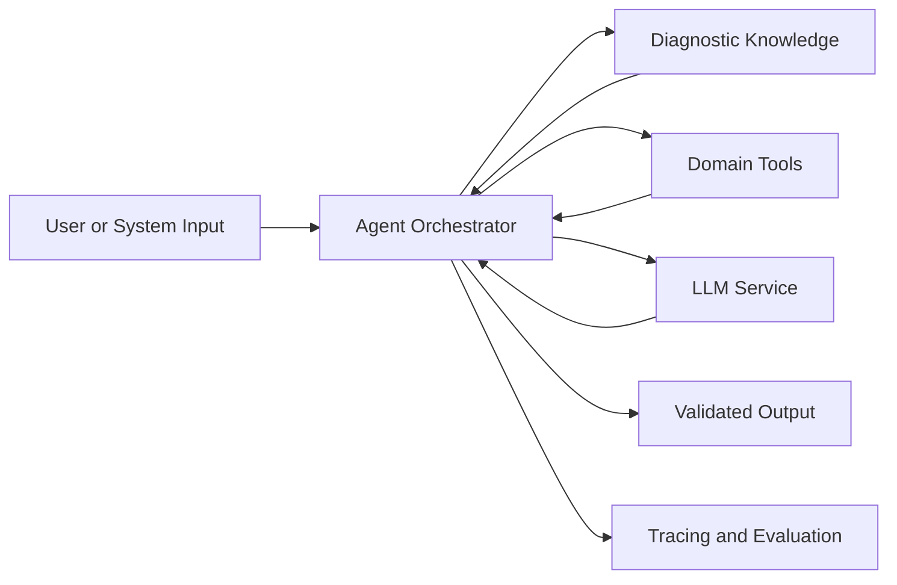

# Industrial Equipment Diagnosis Agent

> Status: `Planning / In Progress / Production` · Role: `TBD` · Timeline: `YYYY.MM — YYYY.MM`

## Overview

<!-- 用 2～3 句话说明项目解决的问题、采用 Agent 的原因，以及可验证的交付结果。 -->

| Item | Details |
| --- | --- |
| Problem | `TBD` |
| Target users | `TBD` |
| Scope | `TBD` |
| Responsibilities | `TBD` |
| Technology stack | `TBD` |
| Outcome | `TBD（使用可验证结果，避免笼统描述）` |

## Business Background

### Context

<!-- 描述现有诊断流程、参与角色和项目触发原因。 -->

### Pain Points

- `待填写：当前流程中的主要问题`
- `待填写：信息、效率或协作方面的限制`
- `待填写：为什么现有方案无法满足需求`

### Goals and Non-goals

| Goals | Non-goals |
| --- | --- |
| `TBD` | `TBD` |

## System Architecture

<!-- 将占位节点替换为真实组件，并在图后说明组件边界、数据流和部署边界。 -->

### Component Responsibilities

| Component | Responsibility | Interface / Protocol |
| --- | --- | --- |
| `TBD` | `TBD` | `TBD` |

## Core Workflow

1. **Input validation** — `描述输入、前置校验和拒绝条件。`
2. **Task planning** — `描述任务如何拆解，以及何时重新规划。`
3. **Knowledge and tool execution** — `描述检索或工具调用顺序。`
4. **Result verification** — `描述证据检查、规则校验和人工介入点。`
5. **Response and feedback** — `描述输出格式、反馈采集和状态闭环。`

### Failure Paths

<!-- 补充超时、工具失败、证据不足、模型异常和降级处理。 -->

## Technical Design

### Agent Runtime

<!-- 描述规划模式、状态机、终止条件、上下文管理与恢复策略。 -->

### Tool Integration

<!-- 描述工具契约、权限、超时、重试、幂等和结果校验。 -->

### Reliability and Observability

<!-- 描述日志、Trace、指标、告警、安全边界与人工接管。 -->

### Key Decisions

| Decision | Alternatives | Rationale | Trade-off |
| --- | --- | --- | --- |
| `TBD` | `TBD` | `TBD` | `TBD` |

## Engineering Challenges

| Challenge | Why It Matters | Approach | Remaining Risk |
| --- | --- | --- | --- |
| `TBD` | `TBD` | `TBD` | `TBD` |

<!-- 建议覆盖非确定性输出、工具可靠性、上下文限制和系统集成等真实挑战。 -->

## Evaluation

### Evaluation Setup

<!-- 说明评测数据来源、样本范围、基线、通过标准和回归机制。 -->

| Metric | Definition | Baseline | Result | Target |
| --- | --- | ---: | ---: | ---: |
| Task success rate | `TBD` | — | — | — |
| Diagnostic quality | `TBD` | — | — | — |
| P95 latency | `TBD` | — | — | — |
| Cost per task | `TBD` | — | — | — |

### Result Analysis

<!-- 分析成功案例、失败样本、指标变化和结论适用边界。 -->

## Lessons Learned

- **What worked:** `TBD`
- **What did not work:** `TBD`
- **Key trade-off:** `TBD`
- **Reusable insight:** `TBD`
- **Next iteration:** `TBD`
