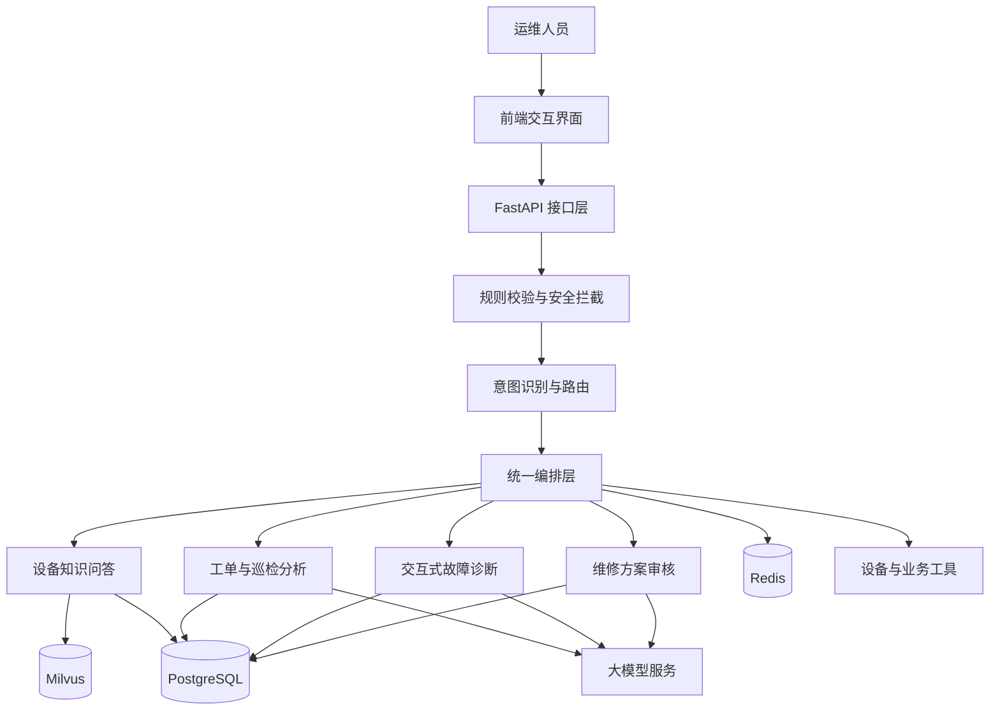

# 工业设备运维与故障诊断协同 Agent

## 1. 项目定位

该项目面向工业设备运维场景，构建基于 LangGraph 的故障诊断与维修协同平台。

系统围绕设备故障处理全过程，将知识问答、工单分析、交互式诊断、维修方案审核等能力统一编排，辅助运维人员完成：

- 故障信息收集；
- 设备状态判断；
- 可能原因分析；
- 维修建议生成；
- 高风险操作确认；
- 工单与诊断过程留痕。

项目强调流程可控、状态可追踪、结果可解释，不采用完全自治式 Agent，而是以确定性工作流为主，在关键节点引入大模型判断。

---

## 2. 业务背景

传统工业设备故障处理通常依赖现场人员经验，存在以下问题：

- 故障描述不统一；
- 设备知识分散在手册、工单和历史案例中；
- 维修方案缺少统一审核标准；
- 多人协作时上下文容易丢失；
- 诊断过程难以追溯；
- 高风险操作需要人工确认。

因此，系统将设备知识、历史工单、诊断流程和大模型能力结合，形成可持续复用的运维协同链路。

---

## 3. 总体架构



---

## 4. 统一编排设计

系统使用 LangGraph 构建状态化工作流。

统一编排层负责：

- 接收用户请求；
- 判断业务意图；
- 选择对应子图；
- 管理任务状态；
- 处理节点失败；
- 控制人工确认；
- 汇总最终结果。

整体不是多个自治 Agent 自由协商，而是：

```text
统一路由
+
多个业务子图
+
显式状态管理
+
条件分支
+
人工审核
```

这种设计更适合工业场景，因为业务流程明确，并且对稳定性、可解释性和责任边界要求较高。

---

## 5. 四类核心业务流程

### 5.1 设备知识问答

用于回答：

- 设备结构；
- 故障现象；
- 保养要求；
- 操作规范；
- 维修步骤；
- 安全注意事项。

检索链路：

```text
用户问题
  ↓
查询理解
  ↓
问题改写
  ↓
向量召回
  ↓
重排序
  ↓
父块回填
  ↓
生成答案
  ↓
返回引用来源
```

技术实现：

- BGE-M3 负责向量化；
- Milvus 负责向量检索；
- BGE-Reranker 负责候选文档精排；
- 根据问题复杂度选择直接检索、多查询改写或 HyDE；
- 证据不足时拒答或进入知识缺口队列。

---

### 5.2 工单与巡检报告分析

系统对工单、巡检记录和故障描述进行结构化抽取。

抽取内容包括：

- 设备信息；
- 故障时间；
- 故障现象；
- 报警代码；
- 已执行操作；
- 更换部件；
- 当前状态。

之后从多个维度并行分析：

- 信息完整性；
- 故障严重程度；
- 维修过程规范性；
- 安全风险；
- 可能根因；
- 复发风险；
- 后续建议。

结构化抽取采用 Pydantic 约束，避免后续节点依赖不稳定的自然语言文本。

---

### 5.3 交互式故障诊断

诊断流程按照阶段推进：

```text
确认设备
  ↓
收集故障现象
  ↓
确认安全状态
  ↓
生成候选原因
  ↓
现场验证
  ↓
给出维修建议
  ↓
人工确认
```

每一阶段都维护明确状态，防止模型跳过关键步骤。

核心设计：

- 使用 `thread_id` 标识一次诊断会话；
- 使用 Checkpointer 持久化中间状态；
- 使用 PostgreSQL 保存诊断记录；
- 使用 `interrupt` 暂停流程；
- 用户补充信息后通过 `Command(resume=...)` 继续执行；
- 通过 SSE 将节点状态和结果实时返回前端。

该流程支持断点恢复，不需要用户在页面刷新后重新开始诊断。

---

### 5.4 维修方案审核

维修方案审核由三部分组成：

```text
硬规则校验
+
语义审查
+
风险评估
```

硬规则负责检查：

- 参数范围；
- 操作顺序；
- 必填项；
- 高风险操作；
- 资质要求；
- 停机条件。

大模型负责：

- 方案完整性；
- 逻辑合理性；
- 与故障原因的一致性；
- 潜在遗漏；
- 维修后验证方式。

高风险方案必须进入人工审核，模型不能直接替代工程师决策。

---

## 6. 业务状态管理

故障处理过程按照明确生命周期推进：

```text
已创建
  ↓
诊断中
  ↓
现场验证
  ↓
方案审核
  ↓
最终确认
  ↓
已关闭
```

每次状态变化都记录：

- 操作人；
- 操作时间；
- 当前阶段；
- 输入信息；
- 输出结果；
- 风险等级；
- 审核意见。

这样可以支持审计、回溯和问题复盘。

---

## 7. 子图之间的数据传递

子图之间不直接传递大段上下文，而是传递业务标识：

```text
case_id
equipment_id
work_order_id
```

下游节点根据标识从 PostgreSQL 读取权威数据。

这种方式可以：

- 减少上下文重复；
- 降低 Token 消耗；
- 避免不同子图持有不一致数据；
- 便于状态恢复；
- 提高数据可追溯性。

---

## 8. 意图路由

系统采用分层路由策略。

```text
规则快速判断
  ↓
MiniLM 分类
  ↓
低置信度时调用大模型复核
  ↓
信息不足时要求用户澄清
```

简单问候、感谢和能力介绍由规则直接处理，避免不必要的大模型调用。

高置信度请求由 MiniLM 路由，低置信度请求再交由大模型判断，在成本和准确率之间取得平衡。

---

## 9. 上下文与记忆管理

短期状态由 LangGraph Checkpointer 管理。

长期数据由 PostgreSQL 保存，包括：

- 设备信息；
- 工单记录；
- 诊断过程；
- 审核结论；
- 人工反馈。

长对话采用：

- 滑动窗口；
- 阶段摘要；
- 任务定制压缩。

压缩时必须保留：

- 当前设备；
- 故障现象；
- 已确认事实；
- 已排除原因；
- 待验证项；
- 安全风险；
- 下一步操作。

---

## 10. 安全与护栏

工业场景不能只依赖提示词。

系统同时使用软约束和硬约束。

### 软约束

- 角色说明；
- 输出要求；
- 安全提示；
- 拒答边界；
- 诊断步骤要求。

### 硬约束

- 输入参数校验；
- 工具白名单；
- 最大诊断轮数；
- 状态阶段校验；
- 高风险操作强制人工确认；
- 证据不足禁止生成确定性结论；
- 输出结构校验；
- 全链路日志记录。

---

## 11. 异常与降级

需要处理的异常包括：

- 模型超时；
- 结构化输出失败；
- 检索无结果；
- 工具调用失败；
- 数据库连接异常；
- 用户中断；
- 状态恢复失败。

对应策略：

- 指数退避重试；
- 主备模型切换；
- 规则结果兜底；
- 降级为知识检索；
- 保存当前状态；
- 转人工处理。

---

## 12. 评测指标

### 路由评测

- 意图分类准确率；
- 低置信度识别率；
- 澄清触发准确率。

### 检索评测

- Recall@K；
- MRR；
- 引用准确率；
- 无答案识别率。

### Agent 评测

- 任务完成率；
- 工具调用成功率；
- 状态流转正确率；
- 中断恢复成功率；
- 高风险拦截率。

### 工程指标

- P95 响应延迟；
- 请求成功率；
- 模型调用成本；
- Token 消耗；
- 人工接管率。

---

## 13. 项目价值

该项目的核心价值不在于让模型完全替代工程师，而在于：

- 统一故障处理流程；
- 降低信息遗漏；
- 提高知识检索效率；
- 沉淀诊断经验；
- 提供过程留痕；
- 对高风险操作增加约束；
- 支持多人协同处理。

---

## 14. 总结

工业设备运维 Agent 的核心架构是：

```text
确定性工作流
+
大模型语义判断
+
RAG 知识检索
+
状态持久化
+
工具调用
+
人工审核
```

项目重点体现了 Agent 在真实业务中的工程化设计，而不是单纯通过多轮对话完成任务。
