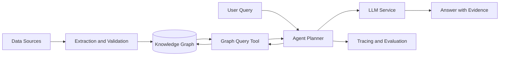

# Knowledge Graph Agent

> Status: `Planning / In Progress / Production` · Role: `TBD` · Timeline: `YYYY.MM — YYYY.MM`

## Overview

<!-- 用 2～3 句话说明项目处理的知识任务、图谱与 Agent 的作用，以及可验证结果。 -->

| Item | Details |
| --- | --- |
| Problem | `TBD` |
| Target users | `TBD` |
| Graph scope | `TBD` |
| Responsibilities | `TBD` |
| Technology stack | `TBD` |
| Outcome | `TBD（使用可验证结果，避免笼统描述）` |

## Business Background

### Context

<!-- 描述知识关系、查询流程和项目启动前的处理方式。 -->

### Pain Points

- `待填写：关系型知识查询或推理方面的问题`
- `待填写：数据质量、解释性或维护方面的限制`
- `待填写：为什么现有方案无法满足需求`

### Goals and Non-goals

| Goals | Non-goals |
| --- | --- |
| `TBD` | `TBD` |

## System Architecture

<!-- 将占位节点替换为真实组件，并说明图谱构建与在线 Agent 推理的边界。 -->

### Component Responsibilities

| Component | Responsibility | Interface / Protocol |
| --- | --- | --- |
| `TBD` | `TBD` | `TBD` |

## Core Workflow

1. **Graph preparation** — `描述 Schema、抽取、实体对齐和质量校验。`
2. **Query understanding** — `描述意图识别、实体解析和约束提取。`
3. **Planning and execution** — `描述图查询生成、校验、执行和重试。`
4. **Evidence synthesis** — `描述路径选择、证据聚合和答案生成。`
5. **Validation and feedback** — `描述结果验证、审计记录和反馈闭环。`

### Failure Paths

<!-- 补充实体歧义、查询失败、图谱缺失、循环调用和权限拒绝处理。 -->

## Technical Design

### Graph Modeling

<!-- 描述 Schema、实体与关系约束、数据溯源和版本演进。 -->

### Agent Reasoning

<!-- 描述规划策略、图查询工具、语法校验、多跳检索和终止条件。 -->

### Reliability and Observability

<!-- 描述只读边界、查询限制、审计、Trace、指标和异常检测。 -->

### Key Decisions

| Decision | Alternatives | Rationale | Trade-off |
| --- | --- | --- | --- |
| `TBD` | `TBD` | `TBD` | `TBD` |

## Engineering Challenges

| Challenge | Why It Matters | Approach | Remaining Risk |
| --- | --- | --- | --- |
| `TBD` | `TBD` | `TBD` | `TBD` |

<!-- 建议覆盖实体消歧、Schema 演进、多跳推理、查询安全和可解释性等真实挑战。 -->

## Evaluation

### Evaluation Setup

<!-- 说明查询集、图谱快照、基线、人工标注、通过标准和回归机制。 -->

| Metric | Definition | Baseline | Result | Target |
| --- | --- | ---: | ---: | ---: |
| Query execution success | `TBD` | — | — | — |
| Path / answer accuracy | `TBD` | — | — | — |
| Evidence coverage | `TBD` | — | — | — |
| P95 latency | `TBD` | — | — | — |

### Result Analysis

<!-- 分析规划、图查询和答案生成阶段的错误，以及结论适用边界。 -->

## Lessons Learned

- **What worked:** `TBD`
- **What did not work:** `TBD`
- **Key trade-off:** `TBD`
- **Reusable insight:** `TBD`
- **Next iteration:** `TBD`
