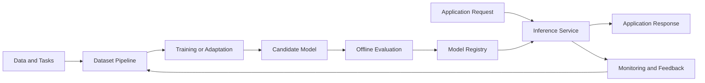

# LLM Optimization

> Status: `Planning / Experimenting / Production` · Role: `TBD` · Timeline: `YYYY.MM — YYYY.MM`

## Overview

<!-- 用 2～3 句话说明目标任务、优化动机、方案范围和可验证结果。 -->

| Item | Details |
| --- | --- |
| Target task | `TBD` |
| Baseline | `TBD` |
| Optimization scope | `TBD` |
| Responsibilities | `TBD` |
| Technology stack | `TBD` |
| Outcome | `TBD（使用可验证结果，避免笼统描述）` |

## Business Background

### Context

<!-- 描述模型所服务的任务、现有方案和优化项目的触发原因。 -->

### Pain Points

- `待填写：质量、延迟、吞吐或成本方面的问题`
- `待填写：数据、硬件或部署环境方面的限制`
- `待填写：为什么现有方案无法满足需求`

### Goals and Non-goals

| Goals | Non-goals |
| --- | --- |
| `TBD` | `TBD` |

## System Architecture

<!-- 将占位节点替换为真实组件，并区分离线实验链路与在线推理链路。 -->

### Component Responsibilities

| Component | Responsibility | Interface / Protocol |
| --- | --- | --- |
| `TBD` | `TBD` | `TBD` |

## Core Workflow

1. **Baseline establishment** — `描述任务、数据、模型和初始指标。`
2. **Experiment design** — `描述假设、变量、对照组和通过标准。`
3. **Training or adaptation** — `描述数据处理、训练或模型压缩流程。`
4. **Evaluation and selection** — `描述质量、性能、成本评测和模型选择。`
5. **Deployment and monitoring** — `描述发布、灰度、回滚和反馈闭环。`

### Failure Paths

<!-- 补充训练失败、质量回退、资源不足、服务异常和回滚处理。 -->

## Technical Design

### Data and Experimentation

<!-- 描述数据来源、清洗、划分、版本、实验追踪和可复现性。 -->

### Model and Inference

<!-- 描述模型选择、训练策略、量化、缓存、批处理、并行和服务框架。 -->

### Reliability and Observability

<!-- 描述模型版本、发布策略、质量监控、性能指标、告警和回滚。 -->

### Key Decisions

| Decision | Alternatives | Rationale | Trade-off |
| --- | --- | --- | --- |
| `TBD` | `TBD` | `TBD` | `TBD` |

## Engineering Challenges

| Challenge | Why It Matters | Approach | Remaining Risk |
| --- | --- | --- | --- |
| `TBD` | `TBD` | `TBD` | `TBD` |

<!-- 建议覆盖数据质量、实验可复现性、资源约束和质量—性能权衡等真实挑战。 -->

## Evaluation

### Evaluation Setup

<!-- 说明数据划分、基线模型、自动与人工评测、硬件环境和回归机制。 -->

| Metric | Definition | Baseline | Result | Target |
| --- | --- | ---: | ---: | ---: |
| Task quality | `TBD` | — | — | — |
| P95 latency | `TBD` | — | — | — |
| Throughput | `TBD` | — | — | — |
| Cost per request | `TBD` | — | — | — |

### Ablation and Result Analysis

<!-- 分离关键变量，说明各项优化的贡献、失败实验和结论适用边界。 -->

## Lessons Learned

- **What worked:** `TBD`
- **What did not work:** `TBD`
- **Key trade-off:** `TBD`
- **Reusable insight:** `TBD`
- **Next iteration:** `TBD`
