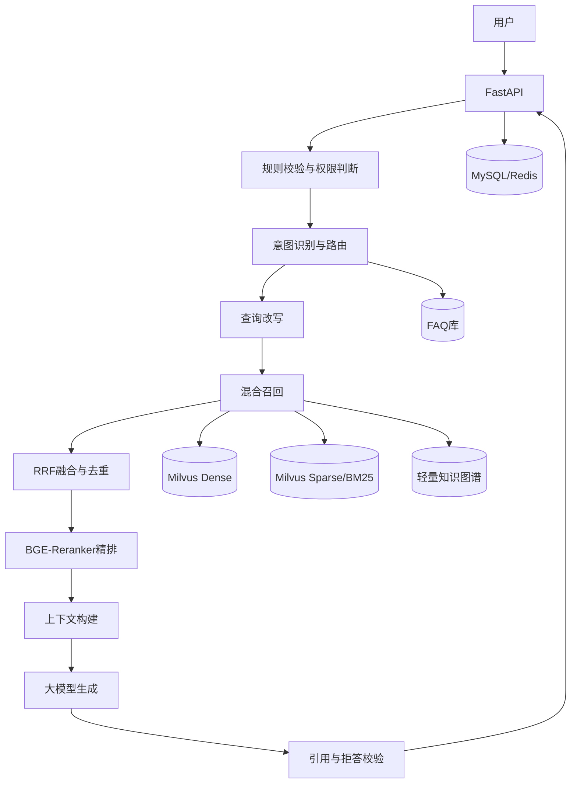

# RAG 工程实践

## 1. RAG 的定位

RAG（检索增强生成）用于把企业私有知识、实时知识和大语言模型结合起来。

基本链路：

```text
用户问题
  ↓
查询理解与改写
  ↓
知识检索
  ↓
候选内容重排
  ↓
上下文构建
  ↓
大模型生成
  ↓
引用与结果校验
```

RAG 主要解决：

- 模型知识存在时间滞后；
- 企业私有数据无法直接进入通用模型；
- 单纯依赖模型参数容易产生幻觉；
- 专业文档数量大，人工查询效率低。

生产级 RAG 的重点不只是“向量库 + 大模型”，而是数据治理、检索优化、效果评测和线上稳定性的完整闭环。

---

## 2. 企业级 RAG 总体架构



---

## 3. 知识入库流程

### 3.1 文档解析

常见数据源：

- PDF；
- Word；
- Excel；
- Markdown；
- 图片与扫描件；
- 业务数据库。

解析阶段需要处理：

- 编码异常；
- OCR 低置信度；
- 页眉页脚和水印；
- 表格结构丢失；
- 图片与正文关联；
- 文档版本冲突。

### 3.2 数据清洗

重点包括：

- 去除重复内容；
- 修复乱码；
- 统一标题层级；
- 保留章节和页码；
- 标记低质量 OCR；
- 补全来源、部门、版本和权限元数据。

### 3.3 切块策略

切块目标不是单纯控制长度，而是保证召回粒度和生成上下文之间的平衡。

常见方式：

- 固定长度切块；
- 按标题层级切块；
- 语义切块；
- 父子切块；
- 句级索引与父块回填。

父子切块适合企业制度和流程文档：

```text
父块：保留完整章节语义
子块：用于精确检索
召回子块后：回填对应父块
```

切块参数需要结合：

- 文档结构；
- Embedding 上下文长度；
- 查询类型；
- 召回数量；
- 最终上下文预算。

### 3.4 向量化与入库

典型链路：

```text
清洗后的 Chunk
  ↓
BGE-M3 Embedding
  ↓
Milvus 向量存储
  ↓
写入元数据
  ↓
生成入库报告
  ↓
质量门禁
  ↓
激活新版本
```

不合格文档进入待处理队列，修复后重新质检，不应直接污染线上知识库。

---

## 4. 查询理解与改写

用户问题可能存在：

- 指代不清；
- 口语化表达；
- 关键词缺失；
- 多轮上下文依赖；
- 一个问题包含多个子意图。

常见策略：

### 4.1 指代消解

将“这个制度”“刚才那个流程”补全为明确对象。

### 4.2 查询改写

把口语问题改写为适合检索的表达。

### 4.3 Multi-Query

生成多个查询变体，提升召回覆盖率。

### 4.4 HyDE

先生成假设性答案，再用其语义进行检索，适合用户问题过短或描述模糊的场景。

查询改写不能无限扩张，否则会引入噪声和额外 Token 成本。

---

## 5. 混合检索

单纯向量检索容易遗漏：

- 精确编号；
- 制度名称；
- 产品型号；
- 缩写；
- 专有名词。

单纯关键词检索又难以理解同义表达和自然语言语义。

因此采用：

```text
Dense 语义召回
+
Sparse/BM25 关键词召回
+
FAQ 或图谱补充
```

### RRF 融合

不同检索通道的分数尺度通常不一致，直接加权容易失真。

RRF 根据排名进行融合：

```text
RRF Score = Σ 1 / (k + rank)
```

优势：

- 不依赖不同通道的原始分数；
- 对多路结果融合更稳定；
- 便于后续统一重排。

---

## 6. Reranker 精排

向量召回负责扩大覆盖范围，Reranker 负责提高最终排序质量。

典型流程：

```text
多路召回 Top-K
  ↓
去重与 RRF 融合
  ↓
Cross-Encoder 精排
  ↓
选择 Top-N
  ↓
父块回填
```

如果 Recall@K 较高但 MRR 较低，说明相关文档已经召回，但排序质量不足，应重点检查：

- Reranker 模型；
- Query 与 Chunk 的拼接方式；
- 候选数量；
- 文档去重策略。

如果 MRR 较高但 Recall@K 较低，则说明检索范围过窄，需要优化召回策略。

---

## 7. 上下文构建

上下文不是把所有召回结果直接拼接。

需要考虑：

- 证据相关性；
- 内容重复；
- 文档优先级；
- 版本有效性；
- Token 预算；
- 多段内容的逻辑顺序。

常见策略：

- 相似内容去重；
- 同一章节合并；
- 按文档权威性排序；
- 保留来源、页码和版本；
- 超过预算时优先保留核心证据。

---

## 8. 生成与拒答

生成阶段要求模型：

- 只能依据给定证据回答；
- 明确区分事实与推断；
- 返回引用来源；
- 证据不足时拒答或进入澄清；
- 不编造不存在的制度和流程。

可采用：

- System Prompt 约束；
- 结构化输出；
- 引用校验；
- 规则后处理；
- 低置信度转人工。

---

## 9. RAG 评测

### 9.1 检索指标

- Recall@K：正确证据是否进入前 K；
- MRR：第一个正确结果排名是否靠前；
- Hit Rate：是否至少命中一个正确文档；
- NDCG：多相关文档排序质量。

### 9.2 生成指标

- 忠实度：回答是否有证据支持；
- 答案相关性：是否真正回答用户问题；
- 上下文相关性：召回内容是否与问题有关；
- 引用准确率：引用是否对应原文；
- 拒答准确率：证据不足时是否正确拒答。

### 9.3 工程指标

- P50/P95 延迟；
- Token 消耗；
- 单次请求成本；
- 检索和模型调用成功率；
- 缓存命中率。

评测应同时包含：

```text
离线评测集
+
线上 Bad Case
+
人工抽检
```

---

## 10. 知识治理

企业知识会持续变化，因此需要版本管理。

核心设计：

- 文件指纹；
- 文档版本；
- 切块版本；
- Embedding 模型版本；
- 索引版本；
- 激活版本；
- 回滚机制。

知识状态可划分为：

```text
待处理
  ↓
已解析
  ↓
待质检
  ↓
已通过
  ↓
已激活
  ↓
已废弃
```

过期、冲突和低质量文档不应直接进入线上检索。

---

## 11. 缓存与性能优化

Redis 可用于：

- FAQ 缓存；
- 查询改写缓存；
- 检索结果缓存；
- 会话状态；
- 限流计数。

需要避免：

- 缓存穿透；
- 热点 Key 击穿；
- 大量 Key 同时过期；
- 缓存与知识版本不一致。

缓存键应包含：

- 租户；
- 知识库；
- 查询；
- 检索策略版本；
- 激活知识版本。

---

## 12. 多租户与权限

企业级 RAG 必须保证不同用户只能检索有权限的知识。

权限过滤应在检索阶段完成，而不是生成后再删除。

常见过滤维度：

- tenant_id；
- dataset_id；
- department_id；
- visibility；
- allowed_roles；
- document_status；
- active_version。

---

## 13. 线上问题定位

RAG 问题通常可分为：

### 数据问题

- 文档解析错误；
- 元数据缺失；
- 版本过期；
- OCR 质量低。

### 召回问题

- Chunk 不合理；
- Embedding 不匹配；
- Query 改写错误；
- TopK 太小。

### 排序问题

- Reranker 效果差；
- 候选重复；
- 权威文档排序靠后。

### 生成问题

- Prompt 约束不足；
- 上下文冲突；
- 引用遗漏；
- 模型自行补充事实。

通过链路日志和 Bad Case 分类，可以避免把所有问题都归因于大模型。

---

## 14. 总结

生产级 RAG 的核心是：

```text
数据治理
+
查询理解
+
混合检索
+
精排
+
上下文构建
+
生成约束
+
评测闭环
```

真正决定系统质量的，通常不是单一模型，而是整个链路能否持续评估、定位问题和迭代优化。
